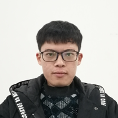

## 
Welcome to My blog

---

Hello,I am XuShuai,an undergraduate from China.My major is _Electronic Information Science and Technology_.
I like programming and electronic design.I have studied C,C++,C#,Matlab and python.Of course,for hardware I have studie 
assembly language and verilog hdl.I like them very much,but I'm not very familiar with anyone of them.I will pay more efferts
on them.Looking forward to progress with you.

---

### [words](word.md)
The words I met on my way to study
### [MCU-FM](MCU-FM.md)
This is the homework of our microcontroller course, a FM radio with measuring temperature.
