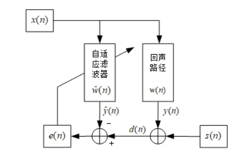

当麦克风同时捕捉到说话的声音和扬声器的声音时，可以使用回声消除算法去掉扬声器播放的声音。

  
>其中，我们可以得到两个信号：一个是蓝色和红色混合的信号1，也就是实际需要发送的speech和实际不需要的echo混合而成的语音流；另一个就是虚线的信号2，也就是原始的引起回音的语音。那大家会说，哦，原来回声消除这么简单，直接从混合信号1里面把把这个虚线的2减掉不就行了？请注意，拿到的这个虚线信号2和回音echo是有差异的，直接相减会使语音面目全非。我们把**混合信号1叫做近端信号ne**，**虚线信号2叫做远端参考信号fe**，如果没有fe这个信号，回声消除就是不可能完成的任务，就像“巧妇难为无米之炊”。

  

## 基于LMS[^1]算法的AEC算法的C++实现

0. 需要音频文件ref.wav和mic.wav。ref.wav是一段音乐，mic.wav是一段女生朗读的音频和ref.wav合并而成的音频文件。程序需要从mic.wav中去掉ref.wav，只留下朗读的音频。

1. **先根据ref.wav生成自适应滤波器。**

   在生成自适应滤波器时，先计算基于远端信号估计的回声：$y=w^{\mathbf{T}} x$，这是一个标量。（我不理解这里为什么不是卷积，为什么不取卷积后的最后一个值做标量，总之，这个转置后乘积在程序里面是 `sum(input*auto_adapt_filter)`）。然后是计算误差：$e(n)=d(n)-y(n)$，这个误差也是一个标量，$d(n)$是期望信号在该片段的最后一个分量。然后去更新自适应滤波器$w(n+1)=w(n)+2 \mu e x(n)$。

   下面的程序就是要构造一个自适应滤波器，它是根据**ref.wav中的信号经过自适应滤波器后的输出信号**与**ref.wav中的信号**的误差更新的。

   ```c++
       while (fread(buf,sizeof(uint16_t),filter_order,fp_ref)==filter_order)
       {
           fseek(fp_ref,(1-filter_order)*sizeof(uint16_t),SEEK_CUR);
   
           vector<float>input;//(buf,buf+filter_order);
           for (int i = 0; i < filter_order; i++)
           {
               input.push_back(float(little2big(buf[i]))/65536);//ignore little2big
           }
           
           float y=sum(input*auto_adapt_filter);//conv(input,auto_adapt_filter).back();//
           float en=capture.back()-y;
   
           auto_adapt_filter=auto_adapt_filter+2*miu*en*input;
           memset(buf,0,sizeof(buf));
       }
   ```

   

2. 得到自适应滤波器后，使用**从mic.wav中读取到的信号**减去**ref.wav中的信号经过滤波器后得到的信号**，从而得到去掉背景音乐的信号。此处ref.wav中的信号经过滤波器使用的是循环卷积

```c++
	while (fread(buf,sizeof(uint16_t),filter_order,fp_mic)==filter_order)
    {
        vector<float>input;//(buf,buf+filter_order);
        for (int i = 0; i < filter_order; i++)
        {
            input.push_back(float(little2big(buf[i]))/65536);
        }
        fread(buf2,sizeof(uint16_t),filter_order,fp_ref);
        vector<float>farend;//
        for (int i = 0; i < filter_order; i++)
        {
            farend.push_back(float(little2big(buf2[i]))/65536);
        }
        vector<float>out=input-conv(farend,auto_adapt_filter);//farend*auto_adapt_filter;//

        uint16_t dat[filter_order];
        for (int i = 0; i < filter_order; i++)
        {
            dat[i]=big2little(uint16_t(out[i]*65536));
        }
        fwrite(dat,sizeof(uint16_t),filter_order,fp_aec);
    }
```

上面的μ为**固定步长因子**，μ的大小很大程度上决定了算法的收敛与稳态性能。μ越大，算法收敛越快，但稳态误差也越大；μ越小，算法收敛越慢，但稳态误差也越小。

归一化最小均方（NLMS）算法是LMS算法的一个扩展，利用**可变的步长因子代替固定的步长因子，就得到了NLMS算法**，它通过计算最大步长值μ绕过了这个问题。
$$
\mu(n)=\frac{\tilde{\mu}}{x(n)^{2}}
$$
其中$\tilde{\mu}$是自适应常量，取值在0~2。**在写程序时发现，使用NLMS时，有些地方信号能量太小，导致$\mu$变得很大，针对这个问题，书上写的方法是在分母上面加上一个常量以防止能量太小，树上的例程里面的常量是0.001[^2].**

自适应滤波器的迭代：
$$
w(n+1)=w(n)+\mu(n) x(n) e(n)
$$
两种算法收敛的比较：

  


>  当远端语音信号到达近端后, 会被 AEC 模块复制作为参考信号, 接着从近端扬声器播放出来, 再被近端麦克风采集送入 $\mathrm{AEC}$ 处理, 如图 5-5 所示, 整个过程的总延迟 $T=T 1+T 2+T 3$ 。**当延迟增大时, 就需要更长的线性滤波器来应付这个延迟**, 而单纯增加滤波器长度不是一个经济、高效的方法。如果我们提前知道了这个延迟, 就可以从缓存 的参考信号中直接选中跟当前近端信号相匹配的那一帧, 而不需要过长的濾波器系数。
>  

---

[^1]: LMS:最小均方(Least Mean Square)

[^2]: 《实时语音处理实践指南》第五章
