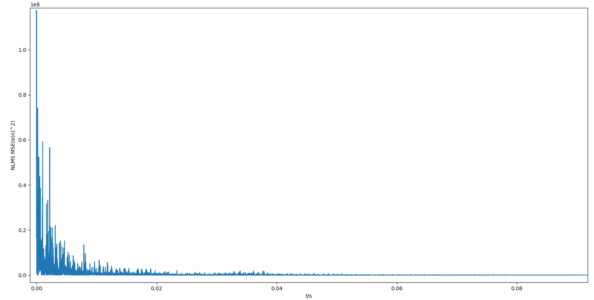
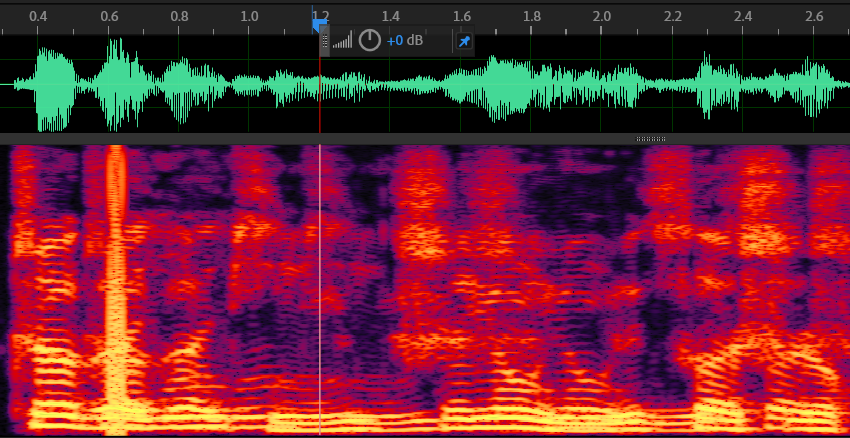
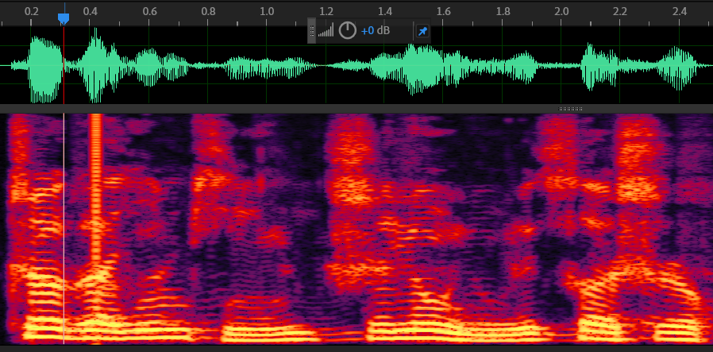

无论是在空旷的屋子里还是幽深的山谷中，我们都很容易听到回声。回声虽然听着很好玩，但是在一些场景中却必须要去除回声，比如免提电话、电话会议系统等情形。本文将主要讨论回声消除算法的归一化最小均方算法（Normalized Least Mean Square）。

声学回声信号根据传输途径的差别可以分别**直接回声**信号和**间接回声**信号：
+ 直接回声（线性回声）：近端扬声器将语音信号播放出来后，被近端麦克风直接采集后得到的回声。直接回声不受环境的印象，与扬声器到麦克风的距离及位置有很大的关系，因此直接回声是一种线性信号。
+ 间接回声（非线性回声）：近端扬声器将语音信号播放出来后，语音信号经过复杂多变的墙面反射后由近端麦克风采集；间接回声的大小与房间环境、物品摆放以及墙面吸引系数等等因素有关，因此间接回声是一种非线性信号。在实际应用中，设备的扬声器和麦克风等电子元器件失真也会导致一定的非线性信号。

需要说明的是，(N)LMS算法主要解决的还是线性回声的问题，非线性回声部分是无法通过线性自适应滤波消除的。正文开始前，我们需要先明白几个概念。假设你和你的朋友A打电话。对于你来说，你这端是**近端**，A那端是**远端**，A那边说话被麦克风采集的信号$x(n)$发送到你这边，这个$x(n)$就是**远端信号**；你这边的麦克风采集到的信号叫**期望信号**$d(n)$。远端信号被你这边的扬声器播放又被你这边的麦克风采集，这中间信号会发生一些变化，这个过程可以看作远端信号$x(n)$经过一个系统$w(n)$成为了麦克风采集的信号(注意信号与系统之间的相互作用用卷积表示)。当你说话时，又产生一个信号$s(n)$。所以期望信号$d(n)$可以认为(忽略图中远端信号播放出来后被反射导致的回声$y(n)$)：$d(n)=s(n)+x(n)*w(n)$


(N)LMS的目的就是要构造一个自适应滤波器$\hat w$去模拟那个回声路径，这样就可以在系统内部估计远端信号播放出来后被麦克风采集到的回声$\hat y(n)$，再使用期望信号和估计回声一相减就可以去掉回声。**在更新自适应滤波器时，近端的你是不能说话的，这一点由双讲检测（Double-Talk Detect, DTD） 模块来保证。**总之，在自适应滤波器更新迭代的过程中，期望信号$d(n)$只有远端信号的回声。

估计的回声和实际的回声之间存在误差：$e(n)=d(n)-\hat{w}(n)*x(n)$，现在需要更新$\hat{w}$使得误差最小。很自然地，我们想到，更新$w(n)$的方法：$w(n+1)=w(n)+\alpha$。这个$\alpha$显然不应该是常量，$w(n)$可能会变大或变小，所以$\alpha$也应当能随着误差变化来变化大小和正负，而导数正好满足这个需求。

通过求导来更新的方法是梯度下降。梯度下降需要求导，需要一个导数为0的位置使得误差能够收敛，更新能够停止。而上面的误差$e(n)$和$\hat{w}$是一次函数关系，是不满足上诉梯度的要求的，于是我们对误差进行平方，$e(n)^2$和$\hat{w}$之间的关系是一个开口向上的抛物线，其梯度是能够满足上诉要求的。对$e(n)^2$求导的公式如下：

^{2}}{\partial%20w}%20=2%20e(n)%20\frac{\partial(d(n)-\hat{w}%20*%20x(n))}{\partial%20w}%20=2%20%20e(n)%20x(n))
我们再对该导数乘以一个步长因子$\mu$对其衰减一下就可以更新自适应滤波器了：

=\hat{w}(n)%2b2\mu%20e(n)x(n))

这个$\mu$的大小很大程度上决定了算法的收敛与稳态性能。$\mu$越大，算法收敛越快，但稳态误差也越大；$\mu$越小，算法收敛越慢，但稳态误差也越小。在LMS算法中$\mu$常取0.02，在NLMS算法中，这个$\mu$是可变的，它是信号能量的倒数：$\mu=\frac{1}{x^{T}(n) x(n)}$。这个$\mu$的计算也是两种算法实现中唯一一个不一样的地方了。

以NLMS算法为例，程序可分为以下四个步骤：

1. 估计回声：$y(n)=x(n)*w(n)$
2. 计算误差：$e(n)=d(n)-y(n)$
3. 计算步长因子：$\mu(n)=\frac{1}{x^{T}(n) x(n)+\alpha}$，在LMS算法中，直接设为一个固定值就可。这里面的$\alpha$是一个很小的值，防止能量太小，导致步长太大。常取0.0001。
4. 更新自适应滤波器：$\hat{w}(n+1)=\hat{w}(n)+\mu(n) e(n) x(n)$，

对应的程序如下：
```c++
        //1.估计回声
        float estimate_echo=conv(buf1,filter_order,filter,filter_order);
        
        int cnt2=echo.get_data((char*)buf2,NULL,2);
        if(cnt2==0)
            break;
        // 2. 计算误差
        float error=buf2[0]-estimate_echo;
        // 3.根据信号能量更新步长因子
        miu=updata_miu(buf1,filter_order);
        // 4.更新自适应滤波器
        for (int i = 0; i < filter_order; i++)
        {
            filter[i]+=miu*error*buf1[filter_order-1-i];
        }
```
完整的程序和音频文件参考这个[仓库](https://github.com/Shuai-xv/nlms_aec.git)

把程序运行过程中的误差的平方绘制出来，可以看到误差随着滤波器的更新越来越小，这说明自适应滤波器越来越接近实际的回声路径：



其效果如图所示：

去除回声前后：

 
  

可以明显感觉到回声消失了。
