# 基础电子电路(Pspice)

本文为我阅读<kbd>电子工程师自学速成-入门篇</kbd>后，结合所学所做的总结。

## 放大电路

**原理**:三极管是具有放大功能的器件，工作在放大状态时要保证发射结正偏，集电结反偏。以NPN三极管为例，其发射区重掺杂，基区薄且掺杂浓度较低。当发射结正偏时，外加电场与自建电场方向相反，自建电场消失，在外加电场作用下，发射区的多子——电子向基区扩散（基区多子——空穴也向发射区扩散）。由于基区掺杂浓度低，发射区重掺杂，故只有少量的电子和空穴复合，再加上基区薄，多余的电子（称为基区的非平衡少子）会穿过基区到达集电区。集电结是反偏的，外加电场与自建电场方向相同，空间电荷区变宽。事实上，基区的非平衡少子一进入该空间电荷区，便会在电场作用下，被扫向集电区。在这个过程中，晶体管便被导通了。
在加入的基区电源$V_{BB}$的作用下，基区电子和空穴的复合源源不断的进行，形成了基极电流$I_{B}$；基区的非平衡少子被扫向集电区，形成了集电极电流$I_{C}$；发射结的多子扩散形成了发射极电流$I_{E}$；其他电流在近似分析中可以忽略。$I_{B}$，$I_{C}$和$I_{E}$的关系为：$$I_{E}=I_{C}+I_{B}$$ $$I_{C}=β*I_{B},(β为放大倍数)$$
常用的NPN三极管放大电路如图：
效果如图：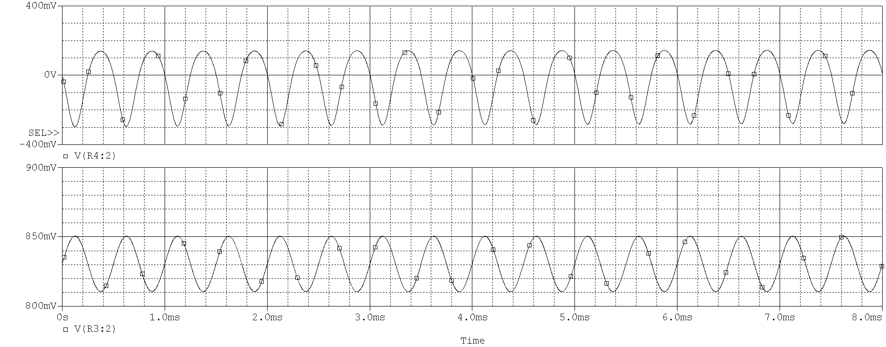

## 谐振电路

谐振电路是由电感和电容所构成的电路，故又称LC谐振电路。通过调节电路元件（L或C）和电源频率，使得电路中的感抗和容抗相位相同，相互抵消，使得整个电路呈现纯电阻性。电路达到这种状态称为**谐振**。谐振电路分为 **串联谐振**和**并联谐振**。

### 串联谐振

串联谐振电路如下图：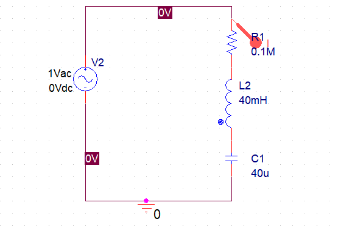
其特性曲线如图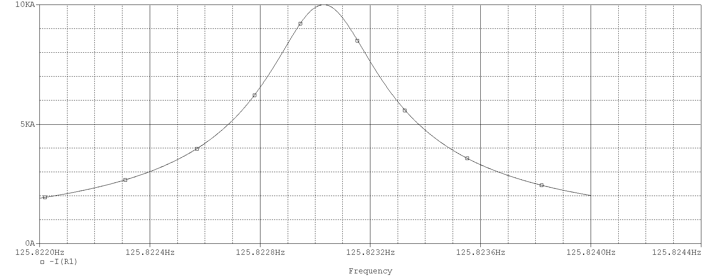
在串联谐振电路中，当交流信号频率为某一频率值（$f_{0}$）时，电路出现最大电流的现象称为串联谐振现象，简称“串联谐振”，这个频率称为谐振频率，用$f_{0}$表示，谐振频率$f_{0}$的大小可用下面的公式来计算$$f_{0}=\frac{1}{2 \pi \sqrt{L C}}$$
其应用如图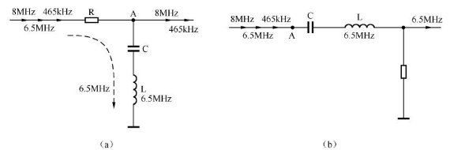
>在图（a）中，L、C元件构成串联谐振电路，其谐振频率为6.5MHz。当8MHz、6.5MHz 和465kHz 3 个频率的信号到达A 点时，LC 串联谐振电路对6.5MHz 信号产生谐振，对该信号阻抗很小，6.5MHz信号经LC串联谐振电路旁路到地，而串联谐振电路对8MHz和465kHz的信号不会产生谐振，它对这两个频率信号的阻抗很大，无法旁路，所以电路**输出8MHz信号和465kHz信号。**

>在图（b）中，LC串联谐振电路的谐振频率为6.5MHz。当8MHz、6.5MHz和465kHz3个频率的信号到达A点时，LC串联谐振电路对6.5MHz信号产生谐振，对该信号阻抗很小，6.5MHz信号经LC串联谐振电路送往输出端，而串联谐振电路对**8MHz和465kHz的信号不会产生谐振**，它对这两个频率信号的阻抗很大，这两个信号**无法通过LC电路**。

### 并联谐振

并联谐振电路如图：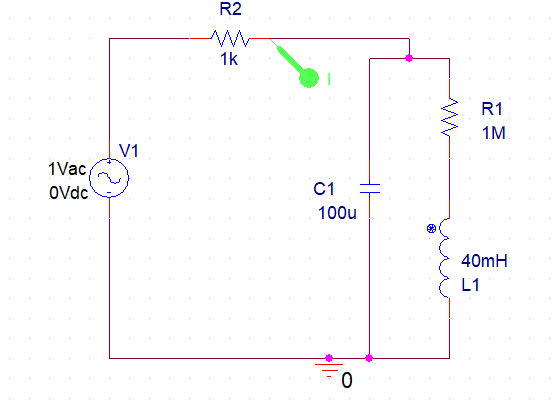
其特性曲线为：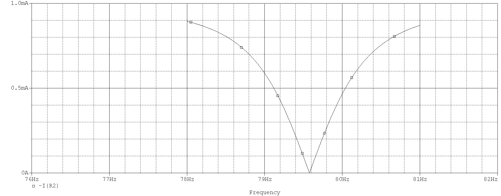
在并联谐振电路中，当交流信号频率为某一频率值（$f_{0}$）时，电路出现最小电流的现象称为并联谐振现象，简称“并联谐振”，这个频率称为谐振频率，用$f_{0}$表示，谐振频率$f_{0}$的大小可用下面的公式来计算$$f_{0}=\frac{1}{2 \pi \sqrt{L C}}$$
并联谐振电路应用：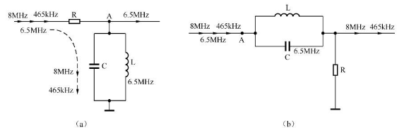
> 在图（a）中，L、C元件构成并联谐振电路，其谐振频率为6.5MHz。当8MHz、6.5MHz 和465kHz 3 个频率的信号到达A 点时，LC 并联谐振电路对6.5MHz 信号产生谐振，对该信号阻抗很大，6.5MHz信号不会被LC电路旁路到地，而并联谐振电路对8MHz和465kHz的信号不会产生谐振，它对这两个频率信号的阻抗很小，这两个信号**经 LC 电路旁路到地**，所以电路**输出6.5MHz信号**。

>在图（b）中，LC 并联谐振电路的谐振频率为 6.5MHz。当 8MHz、6.5MHz 和465kHz 3 个频率的信号到达A 点时，LC 并联谐振电路对6.5MHz 信号产生谐振，对该信号阻抗很大，6.5MHz信号无法通过LC并联谐振电路，而并联谐振电路对**8MHz和465kHz信号不会产生谐振**，它对这两个频率信号的阻抗很小，这两个信号**很容易通过LC电路去输出端**。

**谐振频率的计算：** 由上面的分析可知，谐振频率的计算公式是一样的，那它们是怎么来的呢？因为电感的感抗为$jωL$，电容的容抗为$\frac{1}{jωc}$,谐振时感抗和容抗一定是相互抵消的，故有$jωL=\frac{1}{jωc}$，又因为$ω=2πf$,以上两式联立可得$f=\frac{1}{2 \pi \sqrt{L C}}$

## 振荡器

下图为<kbd>变压器反馈式振荡器</kbd>的电路图，我在仿真时遇到了许多[问题](https://blog.csdn.net/zhaojun666/article/details/104466436)：
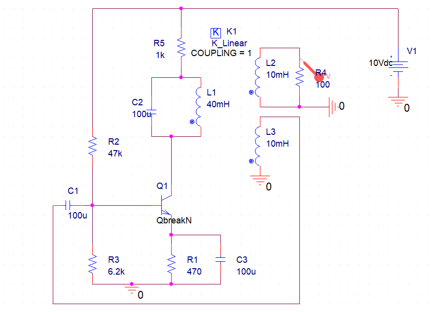
该振荡器产生的振荡信号稳定后效果如下：
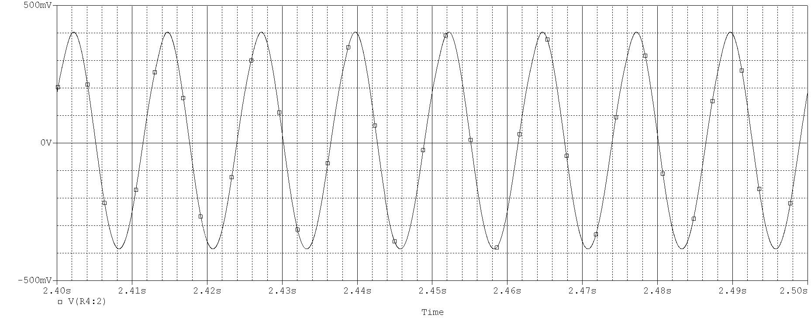
振荡器电路可以分为三部分：放大电路，选频网络，反馈网络。其中$L_{3},C_{1}$构成反馈网络，$C_{2},L_{1},L_{2}$构成选频网络，其余为放大电路。震荡的过程为：在通电的那一刻，通过$L_{1}$的电流瞬间变化，$L_{3}$感应出对应的电流，电流的这一变化过程中含有非常丰富的频率成分（类似阶跃函数中含有0-OOhz的成分，以下用matlab模拟了一下）。

```matlab
%MATLAB
fs=1000;
T=1/fs;
L=1000;
t=-500:500;
s=t>0;
f=fft(s);
f=abs(f/L);
P1=f(1:L/2+1);
P1(2:end-1)=P1(2:end-1)*2;
fre = fs*(0:(L/2))/L;
plot(fre,P1)
title("Fourier transform of step function")
xlabel("fre/hz")
ylabel("Amplitude")
pic=getframe(gcf);
imwrite(pic.cdata,"1.png")
```


该电流信号被送到放大电路作为输入，被放大后送入选频网络。该选频网络是并联谐振电路，存在某一频率的信号$f_{0}$在并联谐振电路中受到的阻抗最大，甚至无法通过，但是它在$L_{1}$中将产生最大的电流，故$f_{0}$信号又感应到$L_{3}$，然后反馈到放大电路的输入端。如此反复进行，放大电路输出的$f_{0}$信号幅度越来越大，反馈到基极的$f_{0}$信号也越来越大。随着反馈信号逐渐增大，三极管的放大倍数$A$不断减小，当放大电路的放大倍数A与反馈电路的衰减系数$\frac{1}{F}$（主要由$L_{1}$与$L_{2}$的匝数比决定）相等时，三极管输出送到$L_{1}$上的$f_{0}$信号电压不能再增大，$L_{1}$上稳定的$f_{0}$信号电压感应到绕组$L_{2}$上，送给需要$f_{0}$信号的电路。

## 电源电路


要把220V的家用交流电转化为稳定的直流电压，需要经过

1. 降压：220V的交流电先经过降压器降压得到较低的交流电压
2. 整流：交流电压经过整流电路变为脉动直流电压
3. 滤波：脉动直流电压经过滤波电路平滑后波动变小
4. 稳幅：再经稳压电路进一步稳压，得到稳定的直流电压

### 整流电路

整流电路可以分为 <kbd>半波整流电路</kbd>，<kbd>全波整流电路</kbd>，<kbd>桥式整流电路</kbd>。

#### 半波整流电路

半波整流电路结构简单，使用元器件少，但整流输出的直流电压波动大，另外由于整流时只利用了交流电压的半个周期（半波），故效率很低，因此半波整流电路常用在对效率和电压稳定性要求不高的小功率电子设备中。
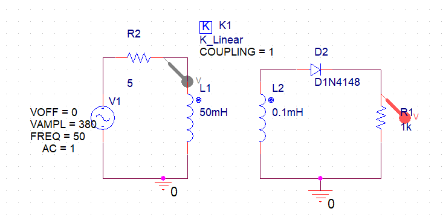
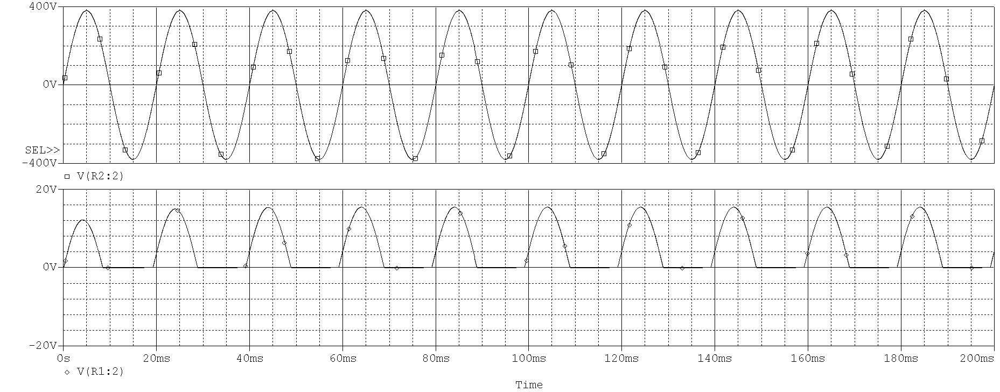

#### 全波整流电路

全波整流能利用到交流电压的正、负半周，效率大大提高，达到半波整流的两倍。全波整流电路的输出直流电压脉动小，整流二极管通过的电流小，但由于两个整流二极管轮流导通，变压器始终只有半个二次绕组工作，变压器利用率低，从而使输出电压低、输出电流小。
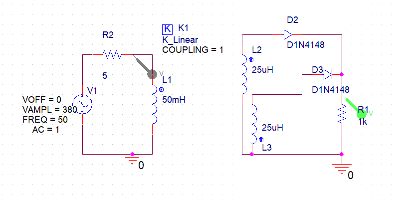
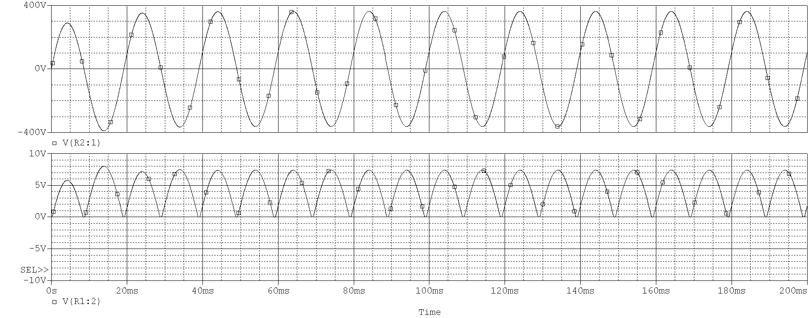

#### 桥式整流电路

桥式整流电路在交流电压整个周期内都能导通，即桥式整流电路能利用整个周期的交流电压。桥式整流电路输出的直流电压脉动小，由于能利用到交流电压的正、负半周，故整流效率高，正因为有这些优点，故大多数电子设备的电源电路都采用桥式整流电路。
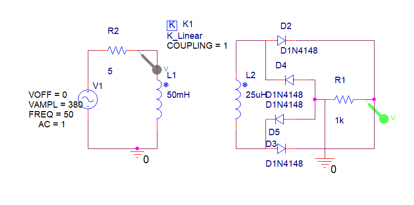
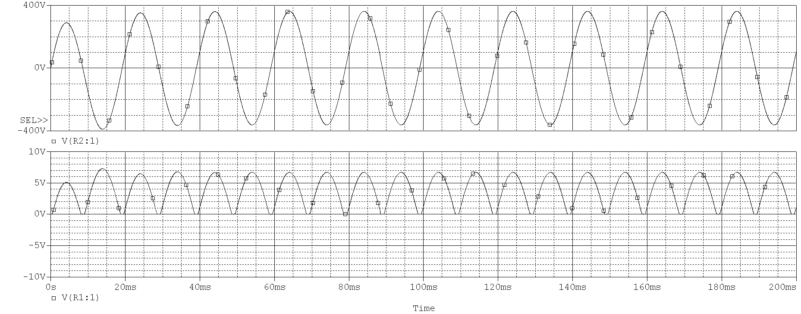

### 滤波电路

整流电路把交流电转为了交流电，然而电流大小仍在不断变化。可以参考上面的整流电路的特性曲线，这样忽大忽小的电流流过负载，负载很难正常工作。为了让流过负载的电流大小稳定不变或变化尽量小，需要在整流电路后加上滤波电路。下面有4种滤波电路。

#### 电容滤波

在桥式整流电路中加入电容滤波：
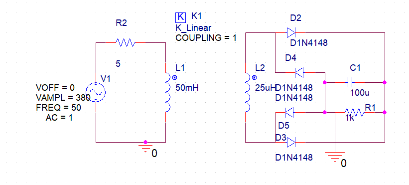
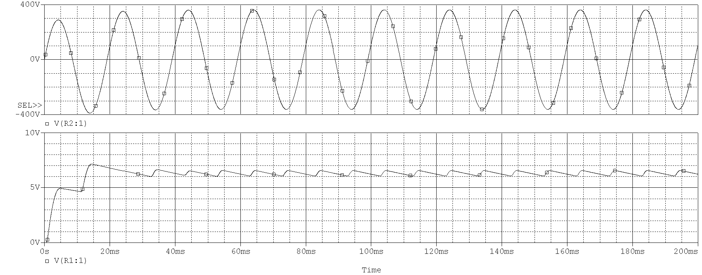

#### 电感滤波

在桥式整流电路中加入电容滤波：
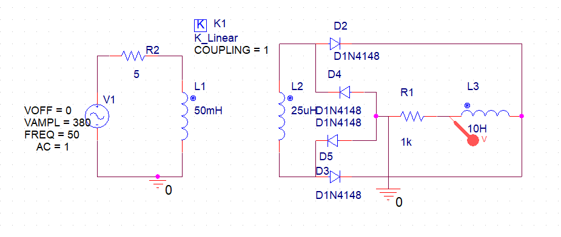
*电感的10H似乎是一个极大的值，然而即使这么大，滤波效果也不是很好*
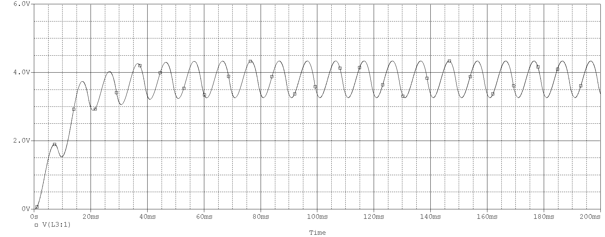

#### 复合滤波

单独的电容滤波或电感滤波效果往往不理想，因此可将电容、电感和电阻组合起来构成复合滤波电路，复合滤波电路的滤波效果比较好。

##### LC滤波

LC滤波电路带负载能力很强，即使负载变化时，输出的电压也比较稳定。另外，**电容接在电感之后，在刚接通电源时，电感会对突然流过的浪涌电流产生阻碍，从而减小浪涌电流对整流二极管的冲击**。
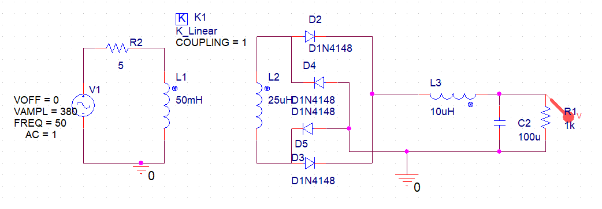
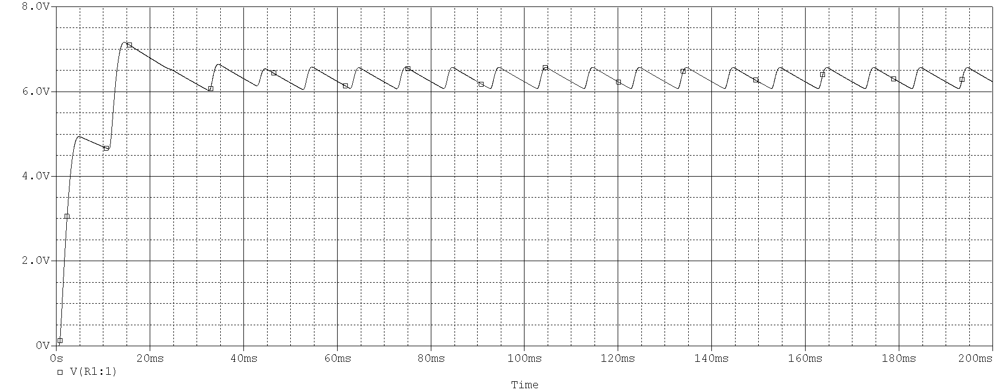

##### LC-π滤波

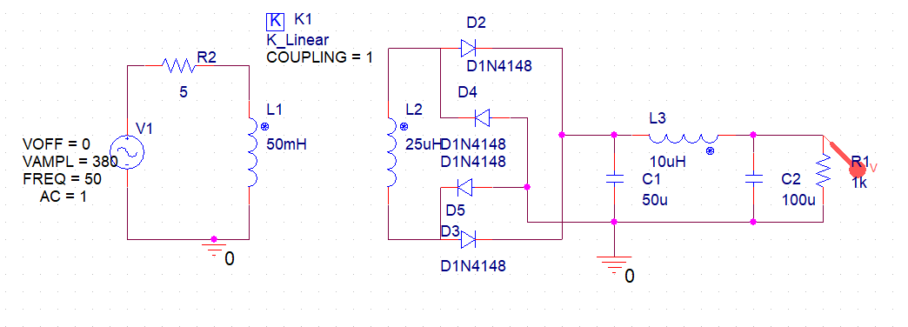
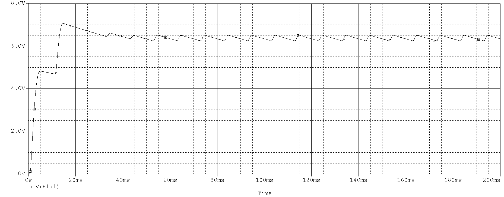
由特性曲线可知，LC-π滤波电路的滤波**效果要好于LC滤波电路**，但它**带负载能力较差**。电容C1接在电感之前，在刚接通电源时，变压器二次绕组通过整流二极管对C1充电的浪涌电流很大，为了缩短浪涌电流的持续时间，一般要求C1的容量小于C2的容量。

### 稳压电路

生活中常会遇到家用电压升高和下降的情况，这将会导致滤波后的电压也发生变化，为了避免这种情况，就需要稳压电路。稳压电路中通常会用到稳压二极管，和普通二极管不同的是，它要反向连接与电路中。

#### 简单的稳压电路

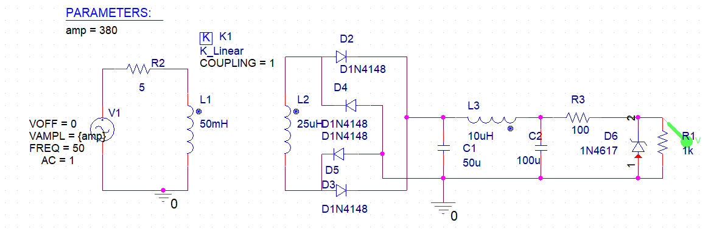
在前面的电路图中，输入电压源是$380sin(2π*50t)$,而在这里，我对电路进行了参数扫描，参数为电压源的峰值，分别取300，380，500。可以看下面的仿真结果，在输入电压大幅变化时，输出电压几乎不变。
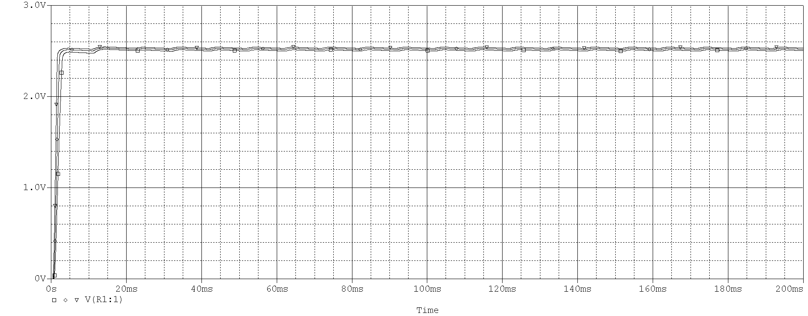

#### 串联型稳压电路

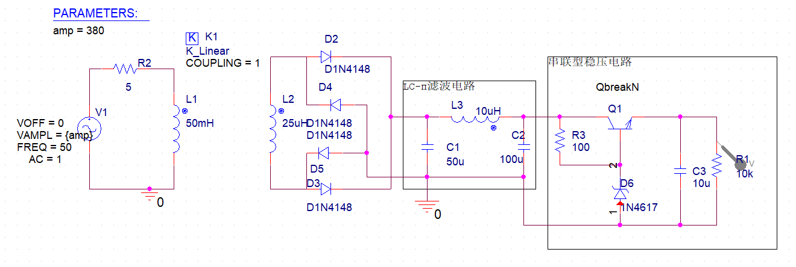
这里的参数扫描设置的值为：100,300,380,500,50000。（我想看看在电压过高和过低的情况，结果50000V的峰值都没能使输出电压超过2V，实际中这是不可能的）
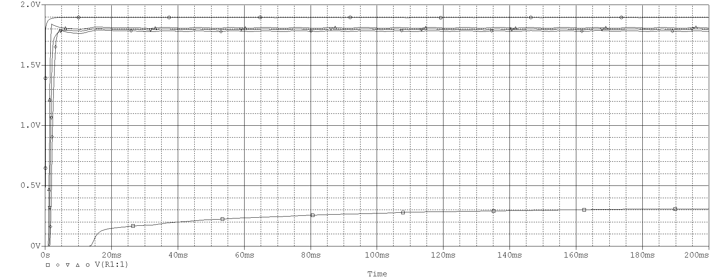
**稳压过程：** 若输入交流电压增大，变压器二次绕组$L_{2}$上的电压也增大，经整流滤波后在$C_{2}$上充得电压增大,导致流过$R_{3}$,$D_{6}$ 的电流增大，$R_{3}$上的电压增大，由于稳压二极管击穿后两端电压保持不变，故$Q_{1}$基极电压也保持不变，则$I_{b}$不变，$I_{c}$也不变。因为电流$I_{c}$大小不变，故$I_{c}$对$C_{3}$充得的电压也保持不变，从而实现了输入电压上升时保持输出电压不变的稳压功能。
