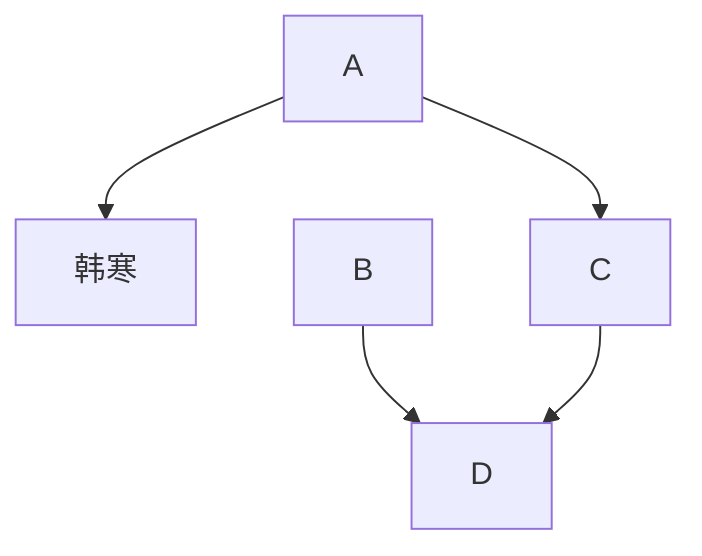
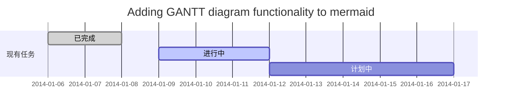

# 电路知识总结

本文为我阅读<kbd>电子工程师自学速成-入门篇</kbd>所做的笔记。

## 放大电路



hdjhjdhjshjkshj[^1]
[^1]:hjhjhjksj

## 谐振电路


hggh

```mermaid
flowchat
    st=>start: 开始
    e=>end: 结束
    op=>operation: 我的操作
    cond=>condition: 确认？

    st->op->cond
    cond(yes)->e
    cond(no)->op
```

## 振荡器

```mermaid
sequenceDiagram
张三 ->> 李四: 你好！李四, 最近怎么样?
李四-->>王五: 你最近怎么样，王五？
李四--x 张三: 我很好，谢谢!
李四-x 王五: 我很好，谢谢!
Note right of 王五: 李四想了很长时间, 文字太长了<br/>不适合放在一行.

李四-->>张三: 打量着王五...
张三->>王五: 很好... 王五, 你怎么样?
## 电源电路

